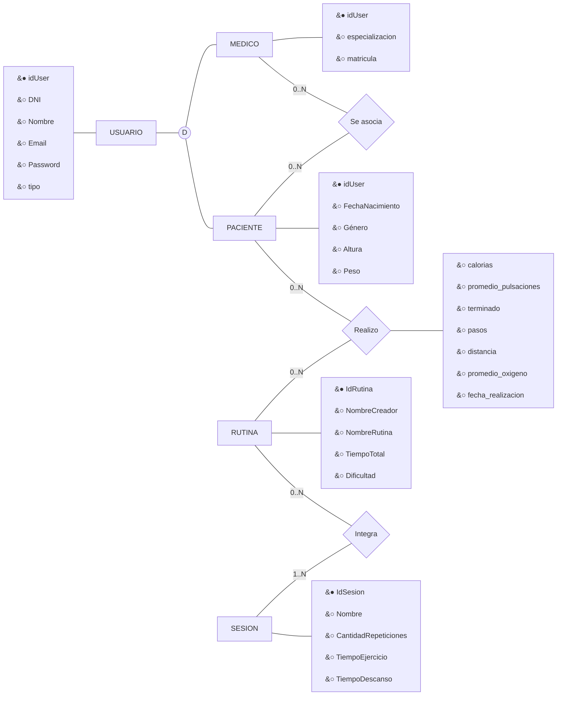

```mermaid
graph LR;
%% Relaciones
    usuario[USUARIO];
    medico[MEDICO];
    paciente[PACIENTE];
    rutina[RUTINA];
    sesion[SESION];
    tipo((D));
    se_asocia{Se asocia};
    realizo{Realizo};
    integra{Integra};

%% Conexiones
    attrs_usuario --- usuario
    usuario --- tipo;
    
    tipo --- medico;
    tipo --- paciente;

    medico --- attrs_medico
    medico -- 0..N --- se_asocia;
    paciente -- 0..N --- se_asocia;
    paciente --- attrs_paciente
    
    realizo --- attrs_realizo
    paciente -- 0..N --- realizo;
    rutina -- 0..N --- realizo;
    
    rutina --- attrs_rutina
    rutina -- 0..N --- integra;
    sesion -- 1..N --- integra;
    sesion --- attrs_sesion

%% Atributos
    attrs_realizo["
        &#9675; calorias<br/>
        &#9675; promedio_pulsaciones<br/>
        &#9675; terminado<br/>
        &#9675; pasos<br/>
        &#9675; distancia<br/>
        &#9675; promedio_oxigeno<br/>
        &#9675; fecha_realizacion<br/>
    "];

    attrs_medico["
        &#9679; idUser<br/>
        &#9675; especializacion<br/>
        &#9675; matricula<br/>
    "];

    attrs_rutina["
        &#9679; IdRutina<br/>
        &#9675; NombreCreador<br/>
        &#9675; NombreRutina<br/>
        &#9675; TiempoTotal<br/>
        &#9675; Dificultad<br/>
    "];

    attrs_sesion["
        &#9679; IdSesion<br/>
        &#9675; Nombre<br/>
        &#9675; CantidadRepeticiones<br/>
        &#9675; TiempoEjercicio<br/>
        &#9675; TiempoDescanso<br/>
    "];

    attrs_paciente["
        &#9679; idUser<br/>
        &#9675; FechaNacimiento<br/>
        &#9675; Género<br/>
        &#9675; Altura<br/>
        &#9675; Peso<br/>
    "];

    attrs_usuario["
        &#9679; idUser<br/>
        &#9675; DNI<br/>
        &#9675; Nombre<br/>
        &#9675; Email<br/>
        &#9675; Password<br/>
        &#9675; tipo<br/>
    "];

%% Estilos
    style attrs_realizo text-align:left;
    style attrs_medico text-align:left;
    style attrs_rutina text-align:left;
    style attrs_sesion text-align:left;
    style attrs_paciente text-align:left;
    style attrs_usuario text-align:left;
```
<!--stackedit_data:
eyJoaXN0b3J5IjpbMTc0MTEyNzI4Ml19
-->